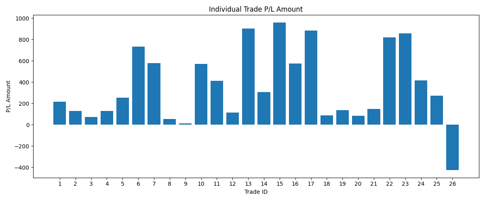

<h1>📈 Stock Buy/Sell Prediction Software</h1>

<h2>About the Software</h2>

This software uses historical stock market data to predict the next trading action – 
whether to <strong>Buy</strong> or <strong>Sell</strong> a stock. It processes past market trends, applies 
machine learning models, and generates predictions in real-time. The program runs continuously and 
automatically takes trade actions while active.

<h2>Installation</h2>

Run the following commands in your terminal to install all required libraries:

<pre>
pip install -r requirements.txt
</pre>

<h2>How to Run</h2>
<ol>
<li>Edit the <code>STOCK_LISTS</code> in <code>config.py</code> according to your requirements.</li>
<li>Set your custom configuration inside <code>config.py</code>.</li>
<li>Run the program using:
<pre>
python RUN_THIS.PY
</pre>
</li>
<li>The software will automatically analyze stock data and take actions while running.</li>
</ol>

<h2>Example Output</h2>

Below are sample output charts generated by the software:

<h2>RELIANCE STOCK GRAPH</h2>

<h2>TATAPOWER STOCK GRAPH</h2>

</body>
